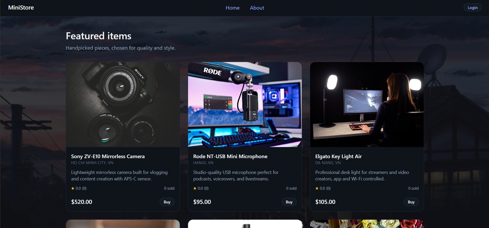
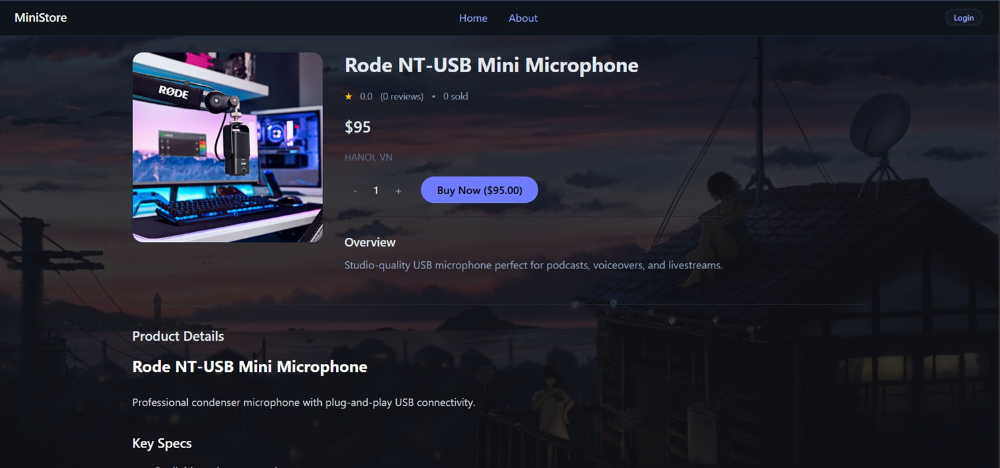
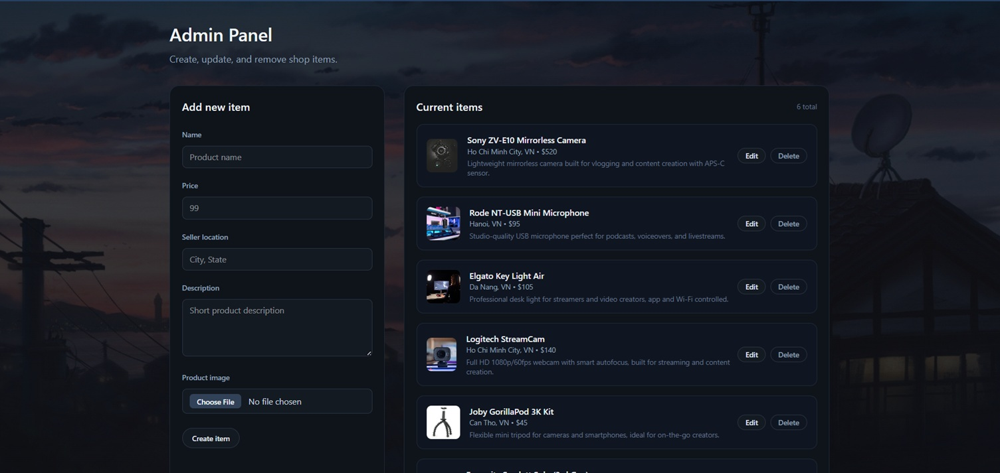

# MiniStore

A compact and easy-to-use full-stack commerce platform for small sellers, built with React, Node.js, Express, and MongoDB.

MiniStore demonstrates how a modern web application can be designed with a modular backend architecture, secure authentication, API protection, and automated developer tooling.

The project focuses on clean architecture, maintainability, and secure API design, while remaining lightweight enough for small sellers or content creators.

## Demo

**Live app:** https://commerce-platform.onrender.com/

> Admin access is restricted to prevent abuse of the live demo.
> If you would like to explore admin features, feel free to reach out.

<!-- Add screenshots below -->
## Screenshots





## Features

### User Features

- Browse and search items
- View item details
- Purchase items
- View purchase history
- Leave item reviews with star ratings
- Authentication via Google OAuth2

### Admin Features

- Create, edit, and delete items
- Upload product images (stored on Supabase Storage)

## Tech Stack

### Frontend

- React
- TailwindCSS

### Backend

- Node.js
- Express.js
- MongoDB + Mongoose
- Supabase Storage (media uploads)

### Authentication & Security

- Google OAuth2
- JWT access tokens in httpOnly cookies
- CSRF protection
- Rotating SHA-256 hashed refresh tokens
- Request validation (express-validator)
- Rate limiting

### Testing

- Vitest
- Supertest

### DevOps

- GitHub Actions (CI/CD)
- Render (Deployment)
- MongoDB Atlas (Cloud Database)

## Developer Tooling

This project includes LLM-assisted tooling that automatically generates:

- Swagger/OpenAPI documentation
- Vitest API regression tests

The tooling analyzes Express routes and controllers to produce documentation and tests automatically, reducing manual development overhead.

**LLM used:** `qwen3-coder:480b-cloud` via Ollama

## Architecture

The backend follows a modular layered architecture:

```
routes → controllers → services → models
```

| Layer | Responsibility |
|-------|---------------|
| Routes | Define API endpoints and attach middleware (auth, validation) |
| Controllers | Handle HTTP requests/responses; delegate logic to services |
| Services | Implement core business logic (purchases, items, reviews) |
| Models | Define MongoDB schemas using Mongoose |

**Example flow:**

```
POST /api/purchases
        ↓
purchaseController.createPurchase()
        ↓
purchaseService.createPurchaseService()
        ↓
Purchase model
```

Benefits:
- **Maintainability** — schema changes are isolated to model/service layers
- **Testability** — services can be tested independently from HTTP logic
- **Clear boundaries** — routes handle API concerns, services handle business logic

## API Protection

- Request validation via `express-validator`
- Rate limiting on authentication endpoints
- Secure httpOnly cookies
- Role-based access control (user / admin)

Mitigates: brute-force attacks, malformed requests, unauthorized access.

## Testing

API regression tests are implemented using Vitest and Supertest.

Test categories:
- Auth routes
- Account routes
- Item routes
- Purchase routes
- Review routes

**Current status: 44 tests passing across 6 test suites**

## CI / CD

Implemented using GitHub Actions:

- **CI** — runs on every push to `main`: installs dependencies, executes test suite
- **CD (Backend)** — triggers automatically after CI passes, deploys to Render
- **CD (Frontend)** — triggers on `frontend/**` changes, deploys to Render

## Future Improvements

- TypeScript refactor for stronger type safety
- Redis caching for high-traffic endpoints
- Payment gateway integration (VNPay / MoMo / ZaloPay)
- Email verification and password reset via Nodemailer

## Local Development

```bash
# Clone the repository
git clone https://github.com/hetoke/commerce-platform.git

# Install backend dependencies
cd backend && npm install

# Install frontend dependencies
cd ../frontend && npm install

# Configure environment variables
cp .env.example .env
cd ../backend && cp .env.example .env

# Start backend
npm run dev

# Start frontend (separate terminal)
cd ../frontend && npm run dev

# Run tests
cd ../backend && npm test
```

## Author

Built as a solo full-stack project focusing on secure backend design, API architecture, and automated development tooling.

GitHub: [hetoke](https://github.com/hetoke)